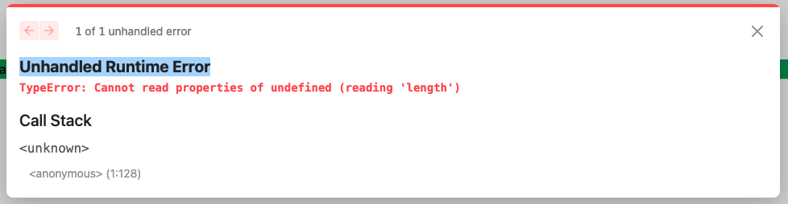

# 202030105 김민정

<br><br>

## 11월 6일

### styled jsx
- styled jsx는 css-in-js라이브러리 입니다. 내장 모듈이기 때문에 설치가 필요 없습니다
- 즉, CSS 속성 지정을 위해 **자바스크립트를 사용할 수 있는** 라이브러리 입니다

```
'use client'
export default function CssEx1() {
    return (
        <>
          <h1>CssEx Component</h1>
          <button className="button">버튼1</button>
          <style jsx>{`
            .button {
                background: green;
                color: white;
            }
          `}
          </style>
        </>
    )
}
```

### css-in-js 단점
- IDE나 코드 편집기 등 개발 도구에 대한 지원이 부족합니다
- 문법 하이라이팅, 자동 완성, 린트 기능을 제공하지 않습니다
- 코드 내에서 **css에 대한 의존성이 점점 커지기 때문에** 앱 번들도 커지고 **느려 집니다**
- 서버에 미리 css를 생성해도 클라이언트에서 리액트 하이드레이션이 끝나면 css를 다시 생성해야 합니다
- 이 때문에 실행 시점에 부하가 커지며, 웹 앱이 계속 느려지게 됩니다. 기능을 추가 할 수록 이런 현상은 심해 집니다.

### CSS Module
- css-in-js의 단점을 회피하기 위한 좋은 방법은 바로 css Module입니다
- pages/index.js를 다음과 같이 수정합니다
```
import styles from './page.module.css';

export default function home() {
  return (
    <>
    <h3 className={styles.main}>main</h3>
    </>
  )
}
```
```
.main {
  display: flex;
  flex-direction: column;
  justify-content: space-between;
  align-items: center;
  padding: 6rem;
  min-height: 100vh;
}
```
- 클래스들은 컴포넌트 스코프를 가집니다
- 생성된 HTML 페이지 소스를 보면 class 이름이 바뀌어 있는 것을 확인할 수 있습니다
- Styled JSX때와 마찬가지로 이런 고유한 이름 때문에 다른 파일이라면 같은 class명을 사용해도 충돌이 일어나지 않습니다
- 만일 전역 CSS을 선언하고 싶다면 styles/globals.css를 만들고 사용합니다
- 파일명은 반드시 globals가 아니어도 되지만 암묵적 합의는 가능하면 지키는 것이 좋습니다
- 이제 _app_js에 import 해주면 모든 컴포넌트에 적용됩니다
- 또 한가지 방법은 class로 선언된 요소에 :global 키워드를 추가해 줍니다

### SASS
- Next에서 기본으로 지원하는 전 처리기 입니다
- 단 패키지 설치가 필요합니다
- SASS 및 SCSS 문법으로 CSS Module을 만들고 사용할 수 있습니다
- styles/Home.module.css 파일 이름을 `styles/Home.module.scss`로 바꿔주면 됩니다
- SASS 기본 설정을 변경해야 하는 경우 next.config.js 설정파일을 변경합니다

[SASS 가이드](https://sass-lang.com/guide/)

```
import scss from '@/styles/foo.module.scss'

export default function SassEx() {
    return (
        <>  
        <div className={scss.foo}>
            <h1>SassEx Page</h1>
            <h2>in Button</h2>
        </div>
        <button>out Button</button>
        </>
    )
}
```
```
$foo: red;

.bar {
    color: $foo;
}

.foo {
    h2 {
        background-color: aqua;
    }
}
```

<br><br><br><br><br><br>

## 10월 30일

### 서버가 데이터 불러오기

- 서버에서는 두 가지 방법으로 HTTP 요청을 만들고 처리할 수 있습니다
  - 1) Node의 내장 `Http 라이브러리`를 사용할 수 있습니다. 다만 서드파티 Http 클라이언트와 비교했을 때 설정하고 처리해야 할 작업이 더 많은 편입니다
  - 2) Http 클라이언트 라이브러리를 사용할 수 있습니다. 가장 유명한 것이 `Axios`입니다

- Axios를 사용하는 이유는 서버와 클라이언트에 모두 적용할 수 있어서 입니다
- Rest API를 호출할 때는 `public API`를 호출할 것인지, `private API`를 호출할 것인지를 먼저 확인해야 합니다

### Rest API - 개요

- REST란 자원을 이름으로 구분하여 그 자원의 상태를 통신을 통해 주고 받는 것을 의미합니다
- 1. HTTP URL을 이용해서 자원을 명시합니다
- 2. HTTP Method를 통해 자원에 CRUD를 적용합니다

<br>

- CURD란 데이터 처리의 기본적인 기능
  - `Create`(생성)
  - `Read`(읽기)
  - `Update`(갱신)
  - `Delete`(삭제)

- REST API란 **REST의 규칙을 적용한 API**를 의미합니다.

### REST API - 기본 설계 규칙

- URI는 동사보다는 명사를, 대문자보다 소문자를 사용하려고 합니다
- 주소의 마지막 슬래시를 포함하지 않습니다
- 단어를 연결할 때는 하이픈을 사용합니다
- 파일확장자는 URI에 포함하지 않습니다
- URI에 메소드를 포함하지 않습니다

### Json Server

- Backend가 개발되기 전이나, 아직 외부 API가 결정되지 않았다면 local에 Json server를 구축하고 Frontend 개발을 하기에 적합한 node 패키지 입니다
- 다음 명령어로 json-server를 설치해 줍니다
```
npm install i -g json-server
```
- json 파일을 만듭니다
```
{
    "posts": [
      { "id": 1, "title": "Hello World", "author": "John Doe" },
      { "id": 2, "title": "Json Server is great!", "author": "Jane Doe" }
    ]
}
```
- 설치가 잘 되었는지 version을 확인해 봅니다
```
json-server --version
```
- 서버 실행
```
json-server --watch data.json --port 3001
```

### Axios란?

- Next.js에서 REST API를 다룰 때는 보통 axios와 fetch 중 하나를 선택하는 경우가 많습니다

[Axios]
- 간편한 문법: 기본적으로 JSON 데이터를 자동으로 변환해주므로, res.data로 쉽게 접을할 수 있습니다

[Fetch API]
- 내장 API: 브라우저에 내장되어 있어 별도의 설치가 필요 없습니다
- Promise 기반: 비동기 작업을 처리하는 데 익숙한 구조입니다
- 스트림 처리: 데이터를 스트리밍으로 처리할 수 있는 기능이 있어, 큰 파일을 처리하는데 유용합니다

[결론]
- 복찹한 요청이나 에러 처리가 필요한 경우에는 axios가 더 적합할 수 있습니다

### Axios 설치

```
npm install axios
```

### Axios 사용하기
- axios.get()을 통해 받아온 응답 객체인 res는 단순히 JSON 데이터만 담고 있는 것이 아니라, HTTP 통신과 관련된 여러 정보들을 함꼐 포함하고 있습니다
```
import axios from 'axios';

// 예시 요청
axios.get('https://jsonplaceholder.typicode.com/posts')
  .then(response => console.log(response.data))
  .catch(error => console.error(error));
```

예를 들어
- res.status: HTTP 응답 상태 코드(200, 404,500 등)

- 그런데 위의 코드는 비동기 데이터 로딩과 상태 관리가 제대로 고려되지 않았기 때문에 몇가지 문제가 있을 수 있습니다
- 특히, Next.js와 같은 리액트 기반 앱에서 비동기 데이터를 처리할 때 렌더링 주기에 맞게 상태를 관리해야 합니다


<br><br><br><br><br><br>

## 10월 23일

### Static Router

- 정적 자원 중 이미지 파일은 `SEO`에 많은 영향을 미칩니다.
- 다운로드 시간이 많이 걸리고, 렌더링 후에 레이아웃이 변경되는 등 UX에 많은 영향을 미칩니다
- 이것을 `누적 레이아웃 이동`이라고 합니다
- image 컴포넌트를 사용하면 CLS문제를 해결합니다
- `lazy loading`: 이미지 로드 시점을 필요할 때까지 지연시키는게 기술입니다
- 이미지 사이즈 최적화로 사이즈를 `1/10이하`로 줄여 줍니다

### Image component - local
- WebP와 같은 최신 이미지 포멧 및 최신 포멧을 지원하지 않는 브라우저를 위해 png fallback으로 제공
- Image 컴포넌트를 사용하면 `다양한 prop`를 전달
- 정적 자원은 기본적으로 `public 디렉토리`에 저장합니다.
- 정적 자원은 번들링 이후에도 변하지 않기 때문입니다
- 이미지를 불러오는 방법은 직접 불러오는 방법과 import하는 방법 2가지가 있습니다
- `width`와 `height` 는 반드시 사용합니다
  - import 하는 방법은 다음 소스처럼 이미지를 import한 후에 이름만 사용하면 됩니다

```
import Image from "next/image";
import foo from "/public/img/forest.jpg"

export default function About() {
    return (
        <>
        <h1>About</h1>
        <h1>About...</h1>
        <Image src="/img/crow.jpg" alt="crow" width={300} height={200}/>
        <Image src={foo} alt="crow" width={300} height={200}/>
        </>
    )
}
```
### Image component - Remote
- pixabay와 같은 외부 이미지를 사용하려면 `next.config.mjs`에 URL을 추가해 줘야함
```
images: {
  remotePatterns: [
    {
      protocol: "https",
      hostname: "cdn.pixabay.com",
    },
  ];
}
```
- 직접 url 지정한 예시
```
export default function About() {
    return (
        <>
        <h1>About</h1>
        <h1>About...</h1>
        <Image src="https://cdn.pixabay.com/photo/2023/07/02/19/58/chamomile-8102907_1280.jpg" alt="flower" width={300} height={200}/>
        </>
    )
}
```

### Unhandled Runtime Error
- Next.js나 React 앱에서 런타임에 처리되지 않은 오류가 발생했음을 나타냄
- 오류 유형: 어떤 종류의 오류인지 (예: `TypeError`, `ReferenceError`, `SyntaxError` 등)


### 디렉토리 구조 구성
- Next.js에서는 특정 파일과 디렉토리가 지정된 위치에 있어야 합니다
  - _app.js나 _document.js파일, pages/와 public/
- Node_modules/: Next.js 프로젝트의 의존성 패키지를 설치하는 디렉토리
- pages/: 애플리케리션의 페이지 파일을 저장하고 라우팅 시스템 관리
- public/: 컴파일된 CSS및 자바스크립트 파일, 이미지, 아이콘 등의 정적 자원 관리
- styles/: 스타일링된 포멧(CSS, SASS, LESS 등)과 관계없이 스타일링 모듈 관리

<br>

- pages/ 디렉토리를 src/ 디렉토리 안으로 옯길 수 있습니다
- public/과 node_modules/를 제외한 다른 디렉토리는 모두 src/로 옮길 수 있습니다

### 유틸리티 구성
- 컴포넌트를 만들지 않는 코드 파일을 유틸리티 스크립트라고 합니다

### 정적 자원 구성
- 정적 자원은 `public/` 디렉토리에서 관리합니다
- 일반적인 웹 애플리케이션에서는 다음과 같은 정적 자원을 사용합니다
  - 이미지 (PNG, JPG, SVG, WebP)
  - CSS 파일
  - JavaScript 파일
  - 폰트 파일 (TTF, WOFF)
  - 파비콘 및 기타 아이콘 파일

### lib 파일 수정
- lib 파일은 **서드파티 라이브러리를 감싸는 스크립트**를 말합니다
- lib 파일은 **특정 라이브러리**에 특화된 것입니다
- 만일 GragpQL을 사용한다면, 클라이언트를 초기화하고, 질의문과 뮤테이션을 지정하는 등의 작업이 필요합니다
- 먼저 이런 스크립트를 좀 더 모듈화하기 위해 프로젝트 root에 lib/grapgql/ 디렉토리를 만틉니다

### 데이터 불러오기
- Next는 클라이언트와 서버 모두에게 데이터를 불러올 수 있습니다
- 서버는 다음 두 가지 상황에서 데이터를 불러올 수 있습니다
  - 1) 정적 페이지를 만들 때 getStaticProps 함수를 사용해서, 빌드 시점에 데이터를 불러올 수 있습니다
  - 2) 서버가 페이지를 렌더링 할때 getServerSideProps를 통해, 실행 도중 데이터를 불러올 수도 있습니다


<br><br><br><br><br><br>

## 10월 11일

### 감기 몸살로 수업을 못 들었습니다. 때문에 수업시간에 배운 내용을 정리하지 못했습니다...

<br><br><br><br><br><br>

## 10월 2일

<br>

### Page Router

```.jsx
export default function index() {
  return (
    <>
      <h1>bar/woo/index page</h1>
      <h1>localhost:3000/bar/woo</h1>
    </>
  );
}

export default function index() {
  return (
    <>
      <h1>bar/index page</h1>
      <h1>localhost:3000/bar</h1>
    </>
  );
}
```

```.jsx

export default function BraIndex() {
  return (
    <>
      <h1>bar/woo/index page</h1>
      <h1>localhost:3000/bar/foo</h1>
    </>
  );
}
```

```.jsx
export default function Foo() {
  return (
    <>
      <h1>foo page</h1>
    </>
  );
}
```

```.jsx
export default function Blog(props) {
  console.log(props);
  return (
    <>
      <h1>Blog page</h1>
      <h1>blog: {props.param.Blog}</h1>
      <h1>blog: {props.searchParams.id}</h1>
      <h1>blog: {props.searchParams.name}</h1>
    </>
  );
}
```

<br> 

### App Router

```.jsx
export default function fooId(){
    return(
        <h1>
            
        </h1>
    )
}
```


<br><br><br><br><br><br>

## 9월 25일
<br>

```.jsx
export default async function Foo() {
    let data = await fetch('https://api.vercel.app/blog')
    let posts = await data.json()
    return (
        <ul>
            {posts.map((post) => (
                <li key={post.id}>{post.id}. {post.title} - {post.date}</li>
            ))}
        </ul>
    )
}
```

- 이렇게 하면 데이터는 서버에서 미리 가져와 클라이언트로 전달되므로 클라이언트에서 **추가적인 API 호출 없이** 데이터를 사용할 수 있습니다.
<br><br>

### Next.js 기초와 내장 컴포넌트
<br>

- Next는 서버사이드 렌더링 외에도 많은 내장 컴포넌트와 함수를 제공합니다
- 클라이언트와 서버에서의 **라우팅 시스템 작동 방식**
- 페이지 간 이동 최적화
- Next.js가 정적 자원을 제공하는 방법
- 자동 이미지 최적화와 새로운 Image 컴포넌트를 사용한 **이미지 제공 최적화 기법**
- 컴포넌트에서 **HTML 메타데이터를 처리하는 방법**
- **_aoo.js와 _documents.js 파일 내용 및 커스터마이징 방법**

<br><br> 

### 라우팅 시스템
<br>

- React 의 React Router, Reach Router 등은 클라이언트 라우팅만 구현할 수 있습니다
- Next는 파일시스템 기반 페이지와 라우팅을 합니다
- 페이지는 /pages 디렉토리 안의 *.js, *.jsx, *.ts, *.tsx 파일에서 export한 React 컴포넌트입니다

<br>

- 만일 블로그와 같이 컨텐츠를 분리해야 한다면 어떻게 해야 할까요?

  - /pages 아래 디렉토리를 만들고 라우팅 규칙을 만들면 됩니다
  - /pages 디렉토리 내부에는 계층적 구조로 라우팅 규칙을 만들 수 있습니다
  - /pages/posts 안에 `index.js`와 `[slug].js`를 만들어 jsx를 반환합니다


<br><br><br><br><br><br>

## 9월 11일

<br>

### 그 밖의 설정...

- 개발 시 타입스크립트를 주 언어로 쓰고 싶다면 앞서 살펴본 것과 같은 방법으로 타입스크립트 전용 플러그인을 설치하고, 설정을 바꿔 주면 됩니다.
- \# **프로젝트를 생성할 대 선택할 수 있기 때문에 생성할 때 설정할 것을 추천** 합니다
  <br>

### 하지만

- 설정을 바꿀 일은 그렇게 많지 않습니다
- 꼭 수정해야 한다면 대부분 next.config 파일의 기본값을 변경한느 것으로도 충분합니다

<br>

### 몇가지 일어날 수 있는 오류

- 처음 Next 프로젝트를 생성할때 오류로 생성되지 않는 경우가 있습니다
- 이 것은 CRA가 설치되어 있지 않아서 생기는 현상입니다
- 이런 경우는 다음과 같이 create-react-app을 Global로 설치해 주면 됩니다

```
$ npm i -g create-react-app
```

<br>

### Transpile은 어떻게 동작하나

- babel은 ECMAScript와 같은 자바스크립트 최신 버전이나, TypeScript**를 이전 버전의 코드로 변환시켜 주는 Transpile 도구** 입니다
- **개발자가 작성한 코드** -> Parse -> Transform -> Generate -> **이전 버전 코드**
- Babel의 Parser는 자바스크립트를 컴퓨터가 이해할 수 있는 코드 구조인 Abstract Syntax Tree로 변환해 주는 역할을 수행합니다
- Babel의 `traverse` 모듈은 전체 트리 상태를 유지하며 노드 교체, 제거, 추가를 담당합니다
- 마지막 `generate`가 수정된 AST를 일반 코드로 변환해 주게 됩니다

<br>

### 왜 SWC를 사용해야 하는가

[Babel의 장점]

- Babel로 변환된 코드를 이해하기 어렵다
- 원 코드에 비해 변환 코드의 길이가 늘어난다
- 변환에 시간이 많이 걸린다

[SWC의 장점]

- Next 12이후 별도의 설정 없이 SWC를 쓸 수 있다

<br>

### SWC를 프로젝트에 적용하려면

- 새로운 프로젝트에 적용하는 것은 다음 명령으로 프로젝트를 생성함녀 바로 사용할 수 있습니다

```
npx create-next-app@latest
```

<br>

### 랜더링 전략

- 랜더링 전략이란 웹 페이지 또는 웹 애플리케이션 웹 브라우저에 제공하는 방법을 의미합니다
- 정적이 페이지 제작에는 `Gatsby`를 추천합니다
- 서버 사이드 렌더링 전략을 원한다면 다른 프레임워크를 검토

- 그런데 `Next.js`에서는 이 모든 방법을 완전히 새로운 수준으로 제공합니다
- 어떤 페이지는 **빌드 시점에 정적으로 생성**하고, 어떤 페이지는 **실행 시점에 동적으로 생성**할지 쉽게 정할 수 있습니다
- 또한 특정 페이지에 대한 요청이 있을 때마다 페이지를 다시 생성할 수도 있습니다
- 그리고 반드시 클라이언트에서 렌더링해야 할 컴포넌트도 지정할 수 있어서 개발이 쉽습니다

<br>

### 서버 사이드 랜더링(SSR)

- 생소할 수도 있지만 웹 페이지를 제공하느 가장 흔한 방법입니다
- APM을 이용하는 일반적인 웹 페이지 생성이라고 보면 됩니다
- 여기에 **자바스크립트 코드가 적제되면 동적**으로 페이지 내용을 렌더링합니다

- Next.js도 이와 같이 동적으로 페이지를 렌더링할 수 있습니다
- 그리고 여기에 스크립트 코드를 집어 넣어서 나중에 웹 페이지를 동적으로 처리할 수도 있는데 이를 **하이드레이션**이라고 합니다

[SSR의 장점]

- 더 안전한 웹 애플리케이션: 쿠키 관리, 주요 API, 데이터 검증 등과 같은 작업을 서버에서 처리하기 때문에 중요한 데이터를 클라이언트에 노출할 필요가 없기 때문입니다
- 더 뛰어난 웹 사이트 호환성: 클라이언트 환경이 자바스크립트를 사용하지 못하거나 오래된 브라우저를 사용하더라도 서비스를 제공할 수 있습니다
- 더 뛰어난 SEO: 서버가 렌더링한 HTML을 받기 때문에 붓이나 웹 크롤러가 페이지를 렌더링할 필요가 없기 때문입니다

<br>

### SSR이 최적의 렌더링 전략이 아닌 경우

- 클라이언트가 페이지를 요청할 때마다 페이지를 다시 렌더링할 수 있느 서버가 필요합니다
- 다른 방식에 비해 SSR이 더 많은 자원을 소모하고, 더 많은 부하를 보이며 유지 보수 비용도 증가합니다
- 페이지에 대한 **요청을 처리하는 시간이 길어**집니다
- 페이지가 외부 API 또는 데이터 소스에 접근해야 한다면, 해당 페이지를 렌더링할 때마다 이를 다시 요청해야 합니다
- 페이지 간의 이동은 CSR에 비해 느립니다

<br>

- 중요한 것은 Next.js가 기본적으로 **빌드 시점에 정적으로 페이지를 만든다는** 것입니다
- 페이지에서 외부 API를 호출하거나 데이터베이스에 접근하는등 동적 작업을 해야 한다면 해당하는 함수를 페이지에 export 합니다

<br>

### 클라이언트 사이드 렌더링(CSR)

- React 앱을 실행하면 렌더링 시작전에 빈 화면이 한동안 유지 되는 것이 보입니다
- 이는 서버에서 스크립트와 스타일만 포함된 HTML을 전송하기 때문입니다
- 실제 렌더링은 클라이언트에서 이루어 집니다
- CSR로 생성한 앱의 HTML을 보면 div태그 하나 밖에 없습니다 그래서 빈 화면만 보였던 겁니다
- 빌드 과정에서 js와 css파일을 html페이지에 불러오도록 만들고 root div에 렌더링 합니다

<br>

### CSR을 사용할 때의 주요 이점

- 네이티브 앱처럼 느껴지는 웹 앱

  - 전체 자바스크립트 번들을 단운로드 한다는 것을 렌더링할 모든 페이지가 이미 브라우저에 다운로드 되어 있다는 뜻입니다
  - 다른 페이지로 이동해도 서버에 요청할 필요가 없어, 바로 페이지를 이동할 수 있습니다
  - 페이지를 바꾸기 위해 새로 고칠 필요가 없습니다

- 쉬운 페이지 전환
  - 클라이언트에서의 내비게이션은 브라우저 화면을 새로 고칠 필요 없이 다른 페이지로의 이동을 가능하게 만듭니다
  - 페이지 간 전환에 멋지 효과를 넣을 수도 있습니다 애니메이션을 방해할 요소가 없기 때문입니다

<br>

#### 장점은 단점이 될 수도 있습니다

- 네트워크 속도가 느린 환경에서는 번들이 모두 다운로드 될 때까지 계속 빈 페이지를 보아야 합니다
- 검색 로봇에게도 그 내용은 빈 것으로 보입니다
- 번들을 모두 받을 때까지 검색 로봇이 기다리기는 하지만 성능 점수는 낮을 것입니다

- React useEffect Hook
- 최근 리액트는 함수형 컴포넌트 사용을 강조하면서 life cycle 함수 대신 Hook을 사용합니다
- 함수형 컴포넌트 내에서 DOM조작이나 데이터 불러오기 같은 사이드 이팩트 기능을 구현할 떼, useEffect 함수를 사용해서

<br>

### process browser 변수

- 서버에서 렌더링할 때 브라우저 전용 API로 인한 문제를 다른 방법으로 해결할 수도 있습니다
- process browser 값에 따라서 스크립트와 컴포넌트를 조건별로 실행하는 것입니다

- 대신 좀 더 정확한 의미를 갖는 typeof window를 사용할 수 있습니다
- typeod window를 서버에서 실행하면 그 값은 문자열 "undefinded"가 되며, 그렇지 않으면 클라이언트에서 실행하게 됩니다

<br>

### 동적 컴포넌트 코딩 - dynamic

- 앞서 React Effect 훅을 사용하여 브라우저에서 코드를 실행하는 경우에만 컴포넌트를 렌더링해 보았습니다
- dynamic 함수로도 똑같이 동작하게 할 수 있습니다
- 다음 코드를 실행하면 Highlight 컴포넌트를 동적 임포트로 불러옵니다

<br>

### 정적 사이트 생성

- SSG는 일부 또는 전체 페이지를 일부 또는 전체 페이지를 빌드 시점에 미리 렌더링합니다
- SSG는 SSR및 CSR과 비교했을때 다음과 같은 장점이 있습니다<br><br>
  **1. 쉬운 확장**
- 정적 페이지는 단순 HTML 파일이므로 CDN을 통해 파일을 제공하거나, 캐시에 저장하기 쉽습니다<br><br>
  **2. 뛰어난 성능**
- 빌드 시점에 HTML 페이지를 미리 렌더링 하기 때문에 페이지를 요청해도 클라이언트나 서버가 무언가를 처리할 필요가 없습니다<br><br>
  **3. 더 안전한 API 요청**
- 외부 API를 호출하거나, 데이터베이스에 접근하거나, 보호해야할 데이터에 접근할 일이 없습니다. 필요한 모든 정보가 빌드 시점에 미리 페이지로 렌더링 되어 있기 때문입니다

- SSG는 높은 확장성과 뛰어난 성능을 보이는 **프론트엔드 애플리케이션을 만들고 싶을 때 가장 좋은 방법**입니다
- 한 가지 문재점은 일단 웹 페이지를 만들고 나면 다음 배포 전까지 내용이 변하지 않는다는 것입니다
- 조금이라도 수정하려면 필요한 데이털르 가져와서 수정하고 다시 생성하는 과정을 반복해야 합니다
- 이런 문제 때문에 나온 방법이 바로 **증분 정적 재생성**입니다
- 예를 들어 동적 콘텍츠를 제공하지만 해당 콘텐츠는 데이터를 로딩하는데 시간이 오래 걸린다면, **ssg와 ISR을 함께 사용하여 문제를 해결**할 수 있습니다

<br><br><br><br><br>

## 9월 4일

### 프로젝트 생성 방법

- 만일 개발환경에 yam 패키지가 설치되어 있다면 Next.js는 yam을 사용하여 프로젝트를 초기화 합니다.
- **npm을 기본으로 사용하고 싶다면** 다음 명령으로 설정을 덮어쓸 수 있습니다

```
  npx create-next-app <app-name> --use-npm
```

<br>

### 프로젝트 구조 설정

- pages/디렉토리 안의 모든 js파일은 public 페이지가 됩니다
- pages/의 index.js파일을 복사해서, about.js로 이름을 바꾸면, localhost:3000/about로 접속해서 들어갈 수 있습니다

<br>

### Next.js의 프로젝트의 기본 구조

- 프로젝트를 생성할 때 /src를 사용 여부를 선택할 수 있고, 일반적으로 사용합니다
- 14에서는 /public과 /src/app 디렉토리만 용도가 정해져 있습니다

<br>

### 타입스크립트 지원

- Next.js는 타입스크립트로 작성되었기 때문에 고품질의 type delinition을 지원합니다
- 기본 언어를 타입스크립트로 지정하려면 root에 tsconfig.json이라는 설정파일 생성하면 됩니다
- 그런 다음 `npm run dev` 명령을 실행하면 다음과 같은 메세지를 확인할 수 있습니다
  - 이 메시지는 주 언어에 대한 **의존성 패키지를 설치**해 달라는 내용입니다
  - 패키지를 설치하고 나면 비어 있는 tscoding.json 파일의 내용이 자동으로 채워집니다
  - vscode를 사용하면 설정 내용이 자동으로 채워지기 때문에 별도의 설치는 필요하지 않습니다

<br>

### 바벨과 웹팩 설정 커스터마이징

- 바벨이나 웹팩의 설정도 커스터마이징 할 수 있습니다
- 바벨은 **자바스크립트 트랜스컴파일러**이며, 최신 자바스크립트 코드를 **하위 호환성을 보장**하는 스크립트 코드로 변환하는 일을 담당합니다
- 하위 호환성이 보장되면 **어떤 웹 브라우저에서든** 자바스크립트 코드를 실행할 수 있습니다
- 바벨을 사용하면 브라우저나 Node.js 등에서 지원하지 않는 **새롭고 훌륭한 기능**을 현재의 환경에서도 실행할 수 있습니다

```
{
  "presets":["next/babel"]
}
```

<br>

### ECMAScropt 기능 중 파이프라인 연산자를 사용해 보자

- 파이프라인은 공식적으로 채택되지 않은 연산자 입니다
- 기능을 사용하려면 **바벨 플러그인을 설치**해야 합니다

```
npm install --save-dev @babel/plugin-transform-runtime
```

<br>

- 그리고 babelrc 파일을 다음과 같이 수정합니다

```
{
  "presets": ["next/babel"],
  "plugins": [
    ["@babel/plugin-transform-runtime"]
  ]
}
```

<br>

<br><br><br><br>

## 8월 28일

### Next.js 알아보기

- Next.js는 리액트를 위해 만든 오픈소스 `자바스크립트 웹 프레임워크` 입니다.

- 리액트는 **다양한 기능을 제공** 합니다.
  - 서버 사이드 렌더링
  - 정적 사이드 생성
  - 증분 정적 재생성

<br>

**SSG(정적 페이지 생성)** 는 미리 만들어 놓은 페이지를 서비스 하기 때문에 **속도는 빠르지만**, 한번 생성하고 나면 **수정이 불가능합니다.** <br>
이러한 단점을 보완하고자 나온 것이 **ISR(증분 정적 재생성)** 입니다.<br>
**이미 생성된 페이지를 일정 시간이 지난 후에 다시 생성합니다.**

<br><br>

### Next.js란?

Angular, React, Vue와 같은 프레임워크가 등장하면서 웹 개발 분야는 급속도로 변하기 시작

1. 리액트는 메타의 조던 발케가 만들어, 2013년 오픈소스를 발표
2. 리액트는 클라이언트 사이드에서만 작동한다는 문제점이 있습니다
   - 검색 엔진 최적화의 효과를 거의 볼 수 없습니다
   - 애플리케이션 실행 초기에 성능 부담이 있습니다
   - 현재 리액트에서도 SSR을 지원하지만 구현은 Next.js보다 복잡합니다

<br><br>

### Next.js가 제공하는 새로운 기능들

- **코드 분할**: 페이지를 로딩 할 때 번들을 여러 조각으로 나누어 필요한 부분만 전송

- 파일 기반 라우팅

- 경로 기반 **프리페칭**: 사용자가 다음에 이동할 수 있는 페이지를 미리 가져오는 기술

- **서버 사이드 렌더링**: 페이지 요청이 올때마다 사전 렌더링

- **정적 사이트 생성**: 빌드하는 동안 페이지를 사전 생성

- **증분 정적 콘텍츠 생성**: 배포 후에도 재 배포 없이 계속 업데이트

- 타입스크립트 기본 지원

- **자동 폴리필** 적용

- **이미지 최적화**: Next/image 컴포넌트로 제공하는 이미지의 최적화 기술

- 웹 애플리케이션의 국제화 지원: **다국어 지원**

- Next.js는 현재 넷플릭스, 트위치, 틱톡, 나이키, 우버, 엘라스틱 등 사이트에서 사용중입니다.

<br><br>

### Next.js와 비슷한 프레임워크

- Gatsby
  - 정적 웹사이트를 만들 수 있는 프레임워크
  - 정적 사이트 생성만 지원
- Razzle
- Nuxt.js
- Angular Universal
  - 정적 사이트 생성과 서버 사이드 렌더링을 지원합니다
  - Nuxt나 Next와는 달리 대기업인 `구글`에서 만들었습니다
  - Angular롤 개발하는 경우 Angular Universal을 사용하는 것이 대부분입니다

<br><br>

### 왜 Next.js일까

- React에서 제공하지 않는 여러 기능을 지원합니다
- 설정이나 개발 옵션 등 다양한 부분에서도 유용한 기능들을 제공합니다
- 활동적인 커뮤니티가 있어 개발 단계별로 많은 지원을 받을 수 있습니다

<br><br>

### 리액트에서 Next.js로

- Next.js의 기본 철학은 React와 거의 같습니다
- "설정보다 관습" 이라는 리액트의 철학을 계승합니다.
- CoC: Convention over Configuration은 개발자가 해야 할 **결정의 수를 줄여**주면서도, **유연성은 잃지 않도록** 하는 소프트웨어 설계 패러다임 입니다
